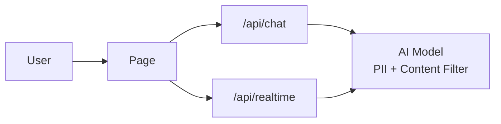

# ai-guard

## Tech Stack

* 套件管理: `pnpm`
* 前端框架: `Next.js 16`
* 後端: `Next.js Route Handlers`
* CSS 框架: `Tailwind CSS`
* 語言: `TypeScript`
* 狀態管理: `React Context`
* UI 元件庫: `Shadcn UI`
* 外部服務: 暫定無
* 部署平台: `Vercel`

## 架構



### 頁面路由

| 路由 | 類型 | 用途 |
|------|------|------|
| `/` | 靜態 | 探索首頁 |
| `/theme` | 靜態 | 探索主題 |
| `/theme/[slug]` | 動態 | 個別探索主題頁面 |
| `/history` | 靜態 | 對話紀錄 |
| `/chat` | 靜態 | 建立新對話 |
| `/chat/[slug]` | 動態 | 指定對話頁面 |
| `/safety` | 靜態 | AI 安全小幫手 |
| `/safety/[slug]` | 動態 | 個別 AI 安全主題頁面 |
| `/parent` | 靜態 | 家長頁面（尚待實作） |

### API 規格

| 端點 | 方法 | 用途 | 格式 |
|------|------|------|------|
| `/api/chat` | POST | 文本對話 | 參考 OpenAI Chat Completions 格式 |
| `/api/realtime` | POST | 語音處理 | Audio blob + 參考 OpenAI Realtime 格式 |

## 開始

```bash
pnpm install
pnpm dev
```

* URL: [http://localhost:3000](http://localhost:3000)

## Deploy on Vercel

The easiest way to deploy your Next.js app is to use the [Vercel Platform](https://vercel.com/new?utm_medium=default-template&filter=next.js&utm_source=create-next-app&utm_campaign=create-next-app-readme) from the creators of Next.js.

Check out our [Next.js deployment documentation](https://nextjs.org/docs/app/building-your-application/deploying) for more details.
