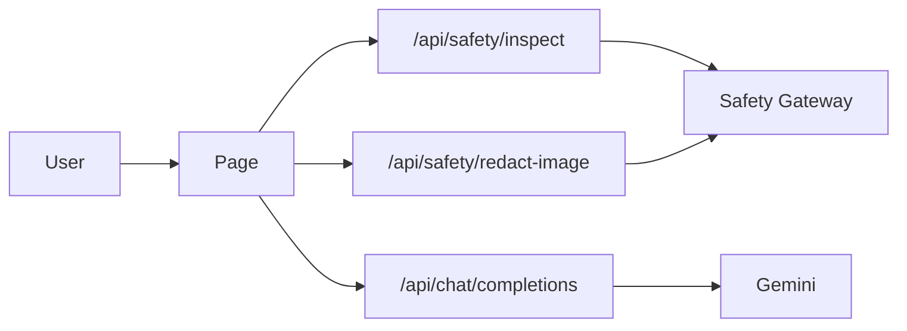

# ai-guard

## Tech Stack

* 套件管理: `pnpm`（Node 22）
* 前端框架: `Next.js 16`
* 後端: `Next.js` Route Handlers（BFF）+ Python Safety Gateway（3.11）
* CSS 框架: `Tailwind CSS`
* 語言: `TypeScript` / Python
* 狀態管理: `React Context`（對話存在瀏覽器 `localStorage`）
* UI 元件庫: `Shadcn UI`
* 外部服務: Google Gemini API、Microsoft Presidio（Gateway 內）
* 部署平台: 暫定本機；畫面之後可放 Vercel，Gateway 需常駐 Python，不能整包丟進 Serverless

## 架構

瀏覽器只打 Next。個資、擋內容、遮圖在 Gateway；要產生回覆才呼叫 Gemini。金鑰與 `SAFETY_GATEWAY_URL` 只在伺服器端。



Gateway 沒開時，文字 inspect 會暫時改用本機規則（僅方便開發）；圖片遮罩會失敗。沒有 `/api/realtime`。

### 頁面路由

| 路由 | 類型 | 用途 |
|------|------|------|
| `/` | 靜態 | 探索首頁 |
| `/theme` | 靜態 | 探索主題 |
| `/theme/[slug]` | 動態 | 個別探索主題頁面 |
| `/history` | 靜態 | 對話紀錄 |
| `/chat` | 靜態 | 建立新對話 |
| `/chat/[slug]` | 動態 | 指定對話頁面 |
| `/safety` | 靜態 | AI 安全小幫手 |
| `/safety/[slug]` | 動態 | 個別 AI 安全主題頁面 |
| `/parent` | 靜態 | 家長頁面（尚待實作） |

安全課程：

| 路由 | 主題 |
|------|------|
| `/safety/privacy-lesson` | 個人資料保護 |
| `/safety/ai-truth-lesson` | 查證 AI 回答 |
| `/safety/stranger-lesson` | 與陌生人互動 |
| `/safety/image-lesson` | 圖片上傳安全 |

### API 規格

| 端點 | 方法 | 用途 |
|------|------|------|
| `/api/safety/inspect` | POST | 送出前個資／內容檢查（轉 Gateway） |
| `/api/safety/redact-image` | POST | 圖片遮罩（轉 Gateway RapidOCR + Presidio） |
| `/api/chat/completions` | POST | 文本對話（Gemini） |

## 開始

需要 Node 22、Python 3.11、pnpm。複製 `.env.example` 為 `.env.local`，填入 `GEMINI_API_KEY`、`GEMINI_MODEL`、`SAFETY_GATEWAY_URL=http://127.0.0.1:8765`。

macOS / Linux：

```bash
cp .env.example .env.local
pnpm install
pnpm dev
```

```bash
python3 -m venv .venv
.venv/bin/pip install -e ".[playground]"
.venv/bin/python -m safety_gateway.playground --host 127.0.0.1 --port 8765
```

Windows（PowerShell）：

```powershell
Copy-Item .env.example .env.local
pnpm install
pnpm dev
```

```powershell
py -3.11 -m venv .venv
.venv\Scripts\python -m pip install -e ".[playground]"
.venv\Scripts\python -m safety_gateway.playground --host 127.0.0.1 --port 8765
```

`pip install -e ".[playground]"`：以可編輯模式安裝本專案，並加上 FastAPI playground。中文 spaCy 模型 `zh-core-web-md` 會一併安裝，不必再執行 `spacy download`。

* 網站: [http://localhost:3000](http://localhost:3000)
* Gateway: [http://127.0.0.1:8765](http://127.0.0.1:8765)

## Deploy

Next 與 Gateway 要分開部署。Vercel 只適合網站；Presidio / spaCy / OCR 請跑在常駐的 Python 服務，並把 `SAFETY_GATEWAY_URL` 指過去。Cloudflare Tunnel 僅供臨時對外試用。
